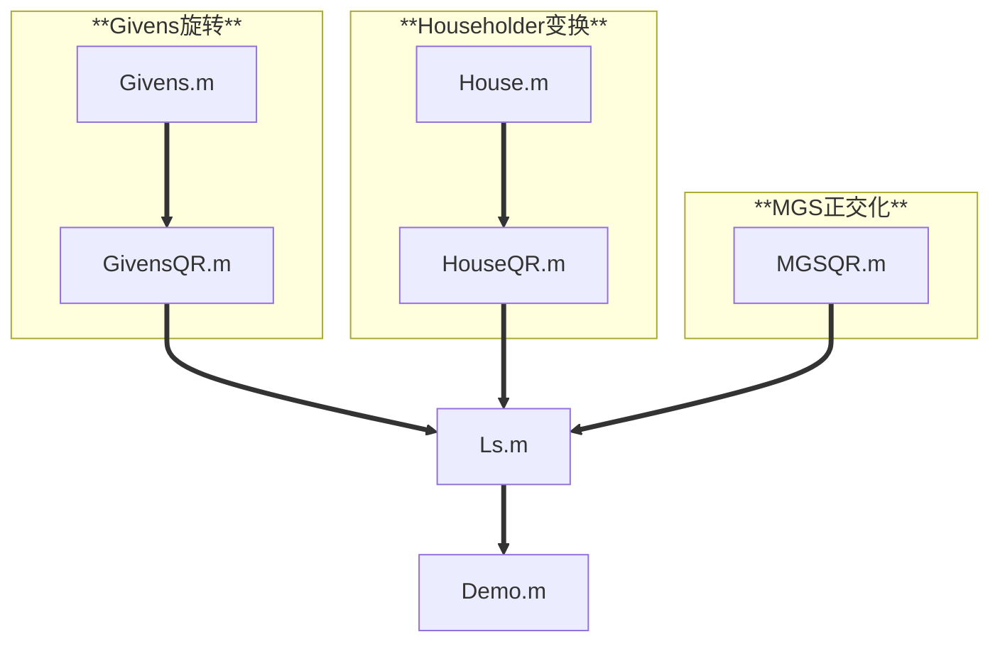

[toc]
## 1.项目简介
本项目实现矩阵QR分解以及利用QR分解完成最小二乘 $min||Ax - b||_2$。
本代码库中包含三种分解方法：
1.Householder变化;
2.Givens旋转;
3.Modified Gram-Schmidt正交化;
主要功能包括生成Givens旋转矩阵和Householder变化矩阵、利用三种方法完成矩阵QR分解、并针对列是否满秩情况下给出相应的最小二乘解和残差。
## 2.主要功能
### 2.1 向量反射和旋转
* 生成给定向量的Householder变换矩阵。
* 生成给定2维向量的Givens旋转矩阵。
### 2.2 矩阵的QR分解
* 使用Householder变换实现QR分解。
* 使用Givens旋转实现QR分解。
* 使用Modified Gram-Schmidt正交化实现QR分解。
### 2.3 矩阵的最小二乘
* 利用QR分解实现矩阵的最小二乘。
## 3.函数说明
### 3.1 House.m
* **反射**  生成给定向量的Householder矩阵
* [v,beta] = House(x)
* x为输入列向量;v为Householder向量;beta为系数算子
* 该向量第一个元素变为原向量的2范数，其余元素变为0
### 3.2 Givens.m
* **旋转** 生成给定2维向量的Givens旋转矩阵
* [c,s] = Givens(a,b)
* a,b为输入列向量的第一、二个分量;c,s为Givens矩阵的旋转元素
* 该向量第二个元素b将变为0
### 3.3 HouseQR.m
* **矩阵分解**  矩阵QR分解（Householder变换）
* [Q,R]=HouseQR(A)
* A为输入矩阵;Q为正交矩阵;R为上三角矩阵
### 3.4 GivensQR.m
* **矩阵分解**  矩阵QR分解（Givens变换）
* [Q,R] = GivensQR(A)
* A为输入矩阵;Q为正交矩阵;R为上三角矩阵
### 3.5 MGSQR.m
* **矩阵分解**  矩阵QR分解(施密特正交化)
* [Q,R] = MGSQR(A)
* A为输入矩阵;Q为正交矩阵;R为上三角矩阵
### 3.6 LS.m
* **矩阵求解**  矩阵最小二乘解
* [Q,R,x,p] = LS(A,b,Options)
* A为输入矩阵;b为常数向量;
* Options为选择进行QR分解的方法：
* Options=1  Householder变换
* Options=2  Givens旋转
* Options=3  Modified Gram-Schmidt正交化
* Q为正交矩阵;R为上三角矩阵;x为最小二乘向量;p为最小二乘残差;
### 3.7 Demo.m
* **一个示例文件**，包含三个算例
* 测试算例1 使用QR分解完成4阶幻方矩阵最小二乘
* 测试算例2 使用QR分解完成8*5随机矩阵最小二乘
* 测试算例3 使用最小二乘拟合数据点，并输出拟合曲线和R方
## 4.组织架构
下面展示整个项目的组织架构图：

## 5.使用方法
**以最小二乘为例**
1.控制台输入help Ls.m。
2.根据帮助，向Ls.m中输入A,b,Options。
3.指定Options，选择用于矩阵QR分解的方法。
4.调用Ls.m文件（[Q,R,x,p] = LS(A,b,Options)）。
5.查看Q,R,x,p结果。
## 6.测试算例
提供测试算例以供读者快速了解和熟悉本项目。
测试算例位于Demo.m文件中。
**测试算例1 使用QR分解完成4阶幻方矩阵最小二乘**
```matlab
A=magic(4); % 非列满秩的
b=rand(4,1);
% 使用Householder变化完成最小二乘
[Q,R,X,p] = LS(A,b,1);
disp("----下面是基于Householder变化实现的矩阵QR分解与最小二乘----");
disp("Q矩阵是:");disp(Q);
disp("R矩阵是:");disp(R);
disp("最小二乘解是:");disp(X);
disp("残差是:");disp(p);
```
**测试算例2 使用QR分解完成8*5随机矩阵最小二乘**
```matlab
A=rand(8,5); % 列满秩的
b=rand(8,1);
% 使用Householder变化完成最小二乘
[Q,R,X,p] = LS(A,b,1);
disp("----下面是基于Householder变化实现的矩阵QR分解与最小二乘----");
disp("Q矩阵是:");disp(Q);
disp("R矩阵是:");disp(R);
disp("最小二乘解是:");disp(X);
disp("残差是:");disp(p);
```
**测试算例3 使用最小二乘拟合数据点，并输出R方**
```matlab
% 导入数据
load("data_2D.mat");
A = [Data(:,1),ones(length(Data(:,1)),1)];
b = Data(:,2);
% 最小二乘
[Q,R,X,p] = LS(A,b,1);
disp(Q);disp(R);disp(X);disp(p);
% 计算R方
Y = X(1)*Data(:,1) + X(2); % Y的估计
SSR = sum((Y - Data(:,2)).^2); % 残差平方和
SST = sum((Data(:,2) - mean(Data(:,2))).^2); % 总平方和
R2 = 1 - SSR/SST; % 计算R方
% 画图展示
syms x; % 定义符号变量
y = X(1)*x + X(2); % 创建参数方程
scatter(Data(:,1),Data(:,2),400,"k."); % 创建参数方程
hold on;
fplot(y,[-1,1],'r','LineWidth',2)
xlabel("x");
ylabel("y");
eq = sprintf('y = %.2fx + %.2f', X(1), X(2)); % 打印公式
text(0.6, 2, eq,"FontSize",15,"Color",'b'); % 添加文本
R2_ = sprintf('R^2 = %.2f', R2); % R方
text(0.6, 1, R2_,"FontSize",15,"Color",'b'); % 添加文本
```
## 7.运行环境
* 本项目基于Matlab 2024a完成，可运行于Matlab 2006a 之后的版本。
* 可使用Visual Studio Code和Matlab运行。
