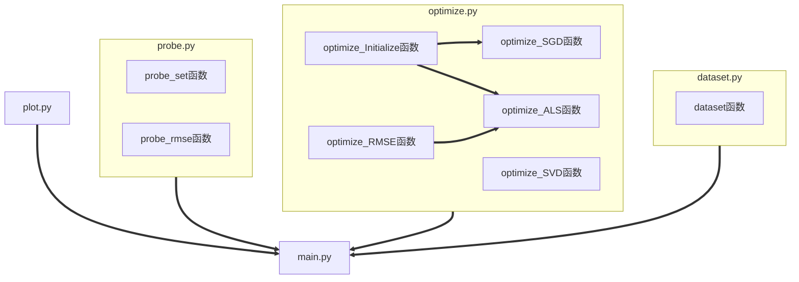

# 文献阅读之推荐算法

[TOC]

## 1. 项目简介

本项目基于文献《*Matrix factorization techniques for recommender systems*》，实现通过矩阵分解的方式预测用户对电影的评分。

## 2. 主要功能

### 2.1 评分矩阵和电影提取

- 生成用户-电影评分矩阵。
- 生成电影信息表。

### 2.2 评分矩阵分解实现

- 通过奇异值分解的方法进行矩阵分解。
- 通过随机梯度下降的方法进行矩阵分解。
- 通过交替最小二乘的方法进行矩阵分解。

### 2.3 预测效果评估

- 构建评估集
- 计算均方根误差

### 2.4 电影特征绘图

- 使用评分矩阵分解的因子向量进行绘图

## 3. 文件说明

### 3.1 main.py

- **主函数**    完成评分矩阵分解预测以及绘图
- `def main(matrix,factors,num):`
- matrix：用户-电影评分矩阵；
- factors：所映射到的n维空间；
- num：构建评估集的数量；

### 3.2 dataset.py

- **预处理**    生成评分矩阵并提取电影信息
- `def dataset(movies_num):`
- movies_num：需要从数据集中提取的前n个电影信息以及相应的电影评分；
- 生成**电影信息.csv**和**用户-电影评分.csv**

### 3.3 optimize.py

- **最优化**    通过不同方法实现最优化的矩阵分解
- `def optimize_Initialize(matrix,factors):`
- matrix：用户-电影评分矩阵；
- factors：所映射到的n维空间；
- 返回一组随机初始化factors空间中的向量
- `def optimize_RMSE(matrix,users,movies):`
- matrix：用户-电影评分矩阵；
- users：用户-因子矩阵；
- movies：电影-因子矩阵；
- 返回均方根误差，用于算法收敛的判定
- `def optimize_SGD(matrix,factors,lambda_,gamma,iterations):`
- matrix：用户-电影评分矩阵；
- factors：所映射到的n维空间；
- lambda_：正则化参数；
- gamma：学习幅度；
- iterations：算法迭代次数；
- 返回最优化后的用户-因子矩阵和电影-因子矩阵
- `def optimize_ALS(matrix,factors,lambda_,iterations,tolerance):`
- matrix：用户-电影评分矩阵；
- factors：所映射到的n维空间；
- lambda_：正则化参数；
- iterations：算法迭代次数；
- tolerance：算法阈值；
- 返回最优化后的用户-因子矩阵和电影-因子矩阵
- `def optimize_SVD(matrix,factors):`
- matrix：用户-电影评分矩阵；
- factors：所映射到的n维空间；
- 返回最优化后的用户-因子矩阵和电影-因子矩阵

### 3.4 probe.py

- **评估**    用于评估矩阵分解预测用于电影评分的效果
- `def probe_set(matrix,num):`
- matrix：用户-电影评分矩阵；
- num：构建评估集的数量；
- 返回由原始数据集随机扣取非零值后生成的新数据集作为训练集，所扣除部分做测试集
- `def probe_rmse(matrix,users,movies,positions):`
- matrix：用户-电影评分矩阵；
- users：用户-因子矩阵；
- movies：电影-因子矩阵；
- positions：记录的从原数据扣除非零值的位置；
- 返回测试集的均方根误差

### 3.5 plot.py

- **绘图**    绘制因子向量代表的电影特征图

## 4. 组织架构

下面展示整个项目的组织架构图：

## 5. 使用方法

1. 首先，进入到文件夹中的dataset.py文件，生成自定义电影数量的数据集。
2. 其次，进入到文件夹中的main.py文件，读取数据集并调用最优化函数。
3. 之后，在main.py文件中使用probe.py方法，评估矩阵分解预测效果。
4. 最后，在main.py文件中使用polt.py方法，生成电影特征图像。

## 6. 数据来源

用户和电影数据来源于2006年的**Netflix Prize**[竞赛题](https://hyper.ai/cn/datasets/5687)，该电影评价数据集包含来自 48 万用户对 1.7 万部电影的评价数据，评价数超过 100 万条，数据采集的时间段为 1998.10 – 2005.11，其中评分以 5 分制为基准，并且用户信息已经经过脱敏处理。

## 7. 运行环境

项目编写环境：**Python 3.12.3**

重要的软件包：

- **numpy 1.26.4**
- **pandas 2.2.3**

可选的运行IDE包括但不限于：Visual Studio Code、Pycharm
